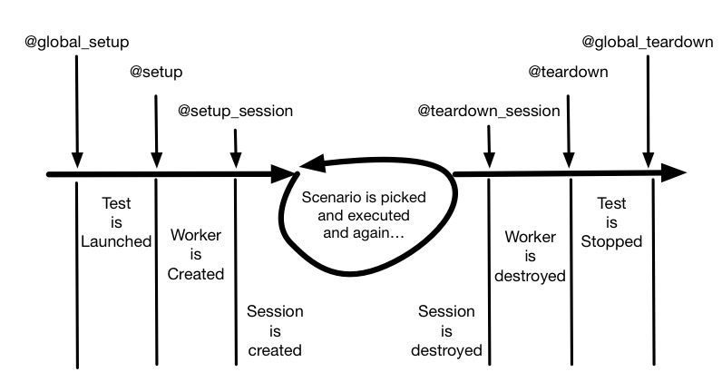

API & Fixtures
==============

To write tests, the only function you need to use is the :func:`scenario` decorator.

.. autofunction:: molotov.scenario

If you don't want scenarii to be picked randomly given the weights, you can
provide your own scenario picker function, by decorating it with the
:func:`scenario_picker` decorator.

.. autofunction:: molotov.scenario_picker

Molotov also provides optional decorators to deal with test fixtures.

The lifecycle of a test is shown in the diagram below, and
test fixtures can be used to run functions at various stages.

.. autofunction:: molotov.global_setup

.. autofunction:: molotov.setup

.. autofunction:: molotov.setup_session

.. autofunction:: molotov.teardown_session

.. autofunction:: molotov.teardown

.. autofunction:: molotov.global_teardown

Here's a full example, in order of calls:

.. literalinclude:: ../../molotov/tests/example4.py
