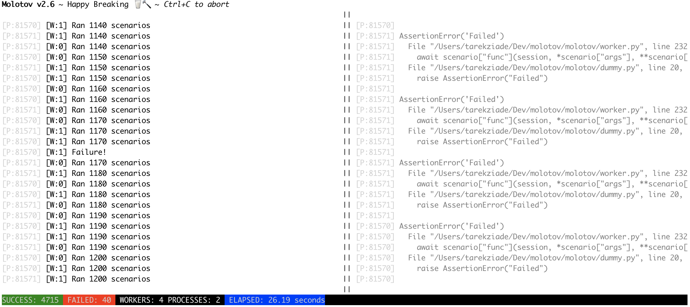

molotov
=======

Simple Python 3.8+ tool to write load tests.

Based on `asyncio <https://docs.python.org/3/library/asyncio.html>`_,
`aiohttp.client <http://aiohttp.readthedocs.io/en/stable/client.html>`_.

Quickstart
==========

To create a load test, you need to create a Python module with some functions
decorated with the **scenario** decorator -- those functions needs to be
coroutines. When executed, the function receives a **session** object inherited
from **aiohttp.ClientSession**.

Here's a full example :

.. literalinclude:: ../../molotov/tests/example2.py

When molotov runs, it creates some workers (coroutines) that will
run the functions indefinitely until the test is over. A test is over
when the time in seconds provided by **--duration** option is reached or
when the maximum number of runs defined by **--max-runs** is reached.

By default, molotov will run for 86400 seconds (one day), but
you can stop it any time with Ctrl-C or by sending a TERM signal to the
process.

Each worker randomly picks one scenario to execute, given their weights.
Once it's finished, it picks the next one, and so on. In our example,
**scenario_two** is picked ~60% of the time.

.. note::

   Check out aiohttp's documentation to understand how to work with
   a session object.

   Link: https://aiohttp.readthedocs.io/en/stable/client.html

To run the load script, you can provide its module name or its path. In the
example below, the script is executed with 10 processes and 200 workers for 60
seconds:

.. code-block:: bash

    $ molotov molotov/tests/example.py -p 10 -w 200 -d 60

When you run molotov, it will start a console application that will
display the activity of each worker on the left panel. When a worker fails,
the error will be displayed on the right panel

The footer will display a count of all successful and failed scenario
runs, along with the current number of active workers (across all processes)
and processes.

Next steps
==========

Check out the detailed documentation:

.. toctree::
   :maxdepth: 2

   installation
   cli
   fixtures
   helpers
   events
   extending
   slave
   docker
   tutorial
   examples
