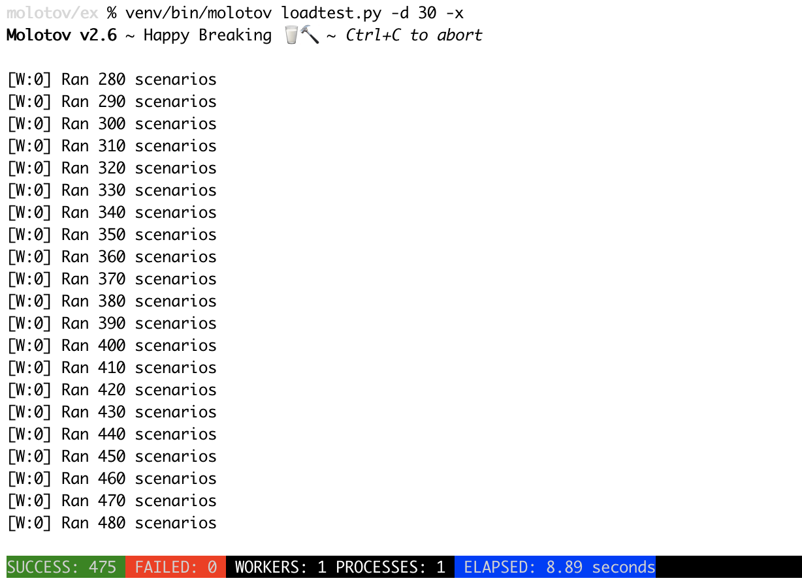

Step-by-step tutorial
=====================

Load testing a service with Molotov is done by creating a Python
script that contains **scenarii**. A scenario is a somewhat
realistic interaction with the service a client can have.

Before you can do anything, make sure you have Python 3.5+ and
virtualenv.

Let's use **molostart** to get started:

.. code-block:: bash

    $ molostart
    **** Molotov Quickstart ****

    Answer to a few questions to get started...
    > Target directory [.]: /tmp/mytest
    > Create Makefile [y]:
    Generating Molotov test...
    …copying 'Makefile' in '/tmp/mytest'
    …copying 'loadtest.py' in '/tmp/mytest'
    …copying 'molotov.json' in '/tmp/mytest'

    All done. Happy Breaking!
    Go in '/tmp/mytest'
    Run 'make build' to get started...

**molostart** creates a default molotov layout for you.
You can build the test with **make build** it will create
a virtualenv inside the directory with Molotov installed.

.. code-block:: bash

    $ cd /tmp/mytest
    $ make build
    $ source venv/bin/activate
    (venv)

If that worked, you should now have a **molotov** command-line.

.. code-block:: bash

    (venv) $ molotov --version
    2.6

Running one scenario
--------------------

Let's open loadtests.py, remove all the examples,
and create our first real load test::

    from molotov import scenario

    @scenario(weight=100)
    async def _test(session):
        async with session.get('https://example.com') as resp:
            assert resp.status == 200, resp.status

Molotov is used by marking some functions with the @scenario decorator.
A scenario needs to be a coroutine and gets a **session** instance that
can be used to query a server.

In our example we query https://example.com and make sure it returns
a 200. Let's run it in console mode just once with `--single-run -c`:

.. code-block:: bash

    (venv) $  molotov --single-run -c loadtest.py
    **** Molotov v2.0. Happy breaking! ****
    Preparing 1 workers...OK
    SUCCESSES: 1 | FAILURES: 0  | WORKERS: 1
    *** Bye ***

It worked!

.. note::

   If you get a cryptic `certificate verify failed` error, make sure
   your Python installation has the root SSL certificates installed. This is
   usually done by installing `certifi`

Let's try for 30 seconds now with the console application (so without `-c`).

.. code-block:: bash

    (venv) $  molotov -d 30 -x loadtest.py

You should see a nice application UI with live updates.

Notice that you can stop the test anytime with Ctrl+C.

The next step is to add more workers with -w. A worker is a coroutine that
will run the scenario concurrently. Let's run the same test with 10
workers:

.. code-block:: bash

    (venv) $ molotov -w 10 -d 30 -x loadtest.py

Molotov can also run several processes in parallel, each one running its
own set of workers. Let's try with 4 processes and 10 workers. Virtually
it means the level of concurrency will be 40:

.. code-block:: bash

    (venv) $ molotov -w 10 -p 4 -d 30 -x loadtest.py

You can usually raise the number of workers to a few hundreds, and the
number of processes to a few dozens. Depending how fast the server
responds, Molotov can reach several thousands requests per second.

Adding more scenarii
--------------------

You can add more scenarii and adapt their weights::

    from molotov import scenario

    @scenario(weight=20)
    async def _test(session):
        async with session.get('https://example.com') as resp:
            assert resp.status == 200, resp.status

    @scenario(weight=20)
    async def _test2(session):
        # do something

    @scenario(weight=60)
    async def _test3(session):
        # do something different

The weights (20/20/60) define how often a scenario is executed by a worker.
These weights does not have to be a sum of 100. Molotov will simply use
this formula to determine how often a scenario is used::

    scenario_weight / sum(scenario weights)

Adding test fixtures
--------------------

Test fixtures are useful when you need to call a function once before
the tests start, and when you want to configure the worker's session
for all calls that will be made with it.

For instance, if you need an Authorization header that's shared across
all workers and processes, you can use :func:`global_setup` to bake it
and :func:`setup` to pass it to the session object that's created
for each worker::

    from molotov import setup, global_setup, scenario

    _HEADERS = {}

    @global_setup()
    def init_test(args):
        _HEADERS['Authorization'] = 'Token xxxx'

    @setup()
    async def init_worker(worker_id, args):
        return {'headers': _HEADERS}

Notice that the function decorated by :func:`setup` needs to be a
coroutine.

Autosizing
----------

Molotov comes with an autosizing feature. When the --sizing option is
used, Molotov will slowly ramp-up the number of workers per process
and will stop once there are too many failures per minute.

The default tolerance for failure is 5%, but this can be tweaked
with the --sizing-tolerance option.

Molotov will use 500 workers that are getting ramped up in 5 minutes,
but you can set your own values with --workers and --ramp-up if you
want to autosize at a different pace.

.. code-block:: bash

    (venv) $ molotov --sizing loadtest.py
